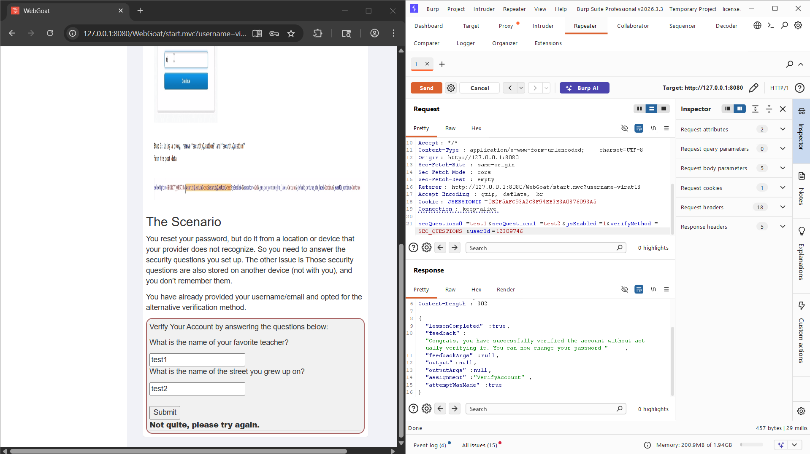

# WebGoat Authentication Bypass – 2FA Password Reset

## Objective

The objective of this WebGoat lesson is to understand how improper validation of security-question parameters can lead to an authentication bypass.

## Scenario

After resetting a password from an unrecognized device or location, the application asks the user to verify their account using security questions.

The questions are:

* What is the name of your favorite teacher?
* What is the name of the street you grew up on?

The objective is to analyze the verification request and identify a weakness in how the application processes the submitted parameters.

## Tools Used

* OWASP WebGoat
* Burp Suite
* Burp Repeater
* Web Browser

## Steps Performed

### 1. Configure Burp Suite

Burp Suite was configured as a proxy between the browser and the WebGoat application.

The security-question verification request was captured using **Proxy → Intercept**.

### 2. Capture the Verification Request

After submitting the security questions, the verification request was intercepted:

```http
POST /WebGoat/auth-bypass/verify-account HTTP/1.1
Host: 127.0.0.1:8080
Content-Type: application/x-www-form-urlencoded; charset=UTF-8

secQuestion0=test1&secQuestion1=test2&jsEnabled=1&verifyMethod=SEC_QUESTIONS&userId=12309746
```

### 3. Send the Request to Repeater

The captured request was sent to **Burp Repeater**.

Repeater allows the request to be modified and resent while observing how the server responds.

### 4. Modify the Parameter Names

The original security-question parameters were:

```text
secQuestion0=test1
secQuestion1=test2
```

The parameter names were modified by inserting an extra character:

```text
secQuestiona0=test1
secQuestiona1=test2
```

The resulting request body was:

```text
secQuestiona0=test1&secQuestiona1=test2&jsEnabled=1&verifyMethod=SEC_QUESTIONS&userId=12309746
```

### 5. Send the Modified Request

The modified request was sent from **Burp Repeater**.

The application accepted the modified request, demonstrating that the verification mechanism was not correctly validating the expected security-question parameters.

### 6. Forward the Edited Request

After confirming that the modified request successfully bypassed the verification in Repeater, the edited request was forwarded through Burp Suite.

The request was allowed to continue to the WebGoat application, completing the authentication-bypass flow.

## Bypass Request

The relevant portion of the bypass request was:

```http
POST /WebGoat/auth-bypass/verify-account HTTP/1.1
Host: 127.0.0.1:8080

secQuestiona0=test1&secQuestiona1=test2&jsEnabled=1&verifyMethod=SEC_QUESTIONS&userId=12309746
```

The key difference is the modified parameter names:

```text
secQuestion0  →  secQuestiona0
secQuestion1  →  secQuestiona1
```

## Vulnerability Analysis

The application appears to rely on the presence and processing of specific client-controlled parameter names during account verification.

By changing the expected parameter names, the verification logic can behave incorrectly and allow the authentication step to be bypassed.

This demonstrates the importance of:

* Strict server-side validation.
* Correct handling of missing or unexpected parameters.
* Never trusting client-controlled authentication data.
* Explicitly rejecting malformed authentication requests.
* Ensuring that every authentication factor is actually verified.

## Key Learning

Burp Suite Repeater is useful for identifying authentication weaknesses because it allows individual request parameters to be modified and tested independently.

The main security principle demonstrated by this lesson is:

> Authentication controls must fail securely when required parameters are missing, malformed, or unexpectedly modified.

## Conclusion

The WebGoat Authentication Bypass lesson demonstrates how improper handling of authentication parameters can result in an authentication bypass.

By capturing the request, sending it to Repeater, modifying the security-question parameter names, confirming the successful response, and forwarding the edited request, the authentication weakness could be demonstrated in the controlled WebGoat environment.
